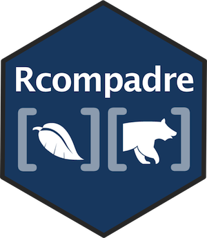

<!-- README.md is generated from README.Rmd. Please edit that file -->

```{r, echo = FALSE}
knitr::opts_chunk$set(
  collapse = TRUE,
  comment = "#>",
  eval = TRUE
)
options(digits = 4)
```

# Rcompadre  

[](https://travis-ci.org/jonesor/Rcompadre) [](https://ci.appveyor.com/project/jonesor/Rcompadre) [](https://codecov.io/github/jonesor/Rcompadre?branch=devel)

An R package to work with the [COM(P)ADRE](https://www.compadre-db.org/) Plant and Animal Matrix Population Databases. Note this package is at an early stage of development, and may contain bugs. 


## Installation

Install from GitHub with:

```{r, eval=FALSE}
# install package 'remotes' if necessary
# will already be installed if 'devtools' is installed
install.packages("remotes") 

# argument 'build_opts = NULL' only needed if you want to build vignettes
remotes::install_github("jonesor/Rcompadre", build_vignettes = TRUE)

# use argument 'build_vignettes = FALSE' if the vignette build fails
remotes::install_github("jonesor/Rcompadre", build_vignettes = FALSE)

```

To install the development branch use:

```{r, eval=FALSE}
remotes::install_github("jonesor/Rcompadre", ref = "devel")
```

## Usage

```{r, eval=FALSE}
library(Rcompadre)
```

#### Fetching a database

Fetch the most recent database version from [compadre-db.org](https://www.compadre-db.org/) with

```{r, eval=FALSE}
compadre <- cdb_fetch("compadre") # or use 'comadre' for the animal database
```

or load from a local `.RData` file with, for example:

```{r, eval=FALSE}
compadre <- cdb_fetch("path/to/file/COMPADRE_v.4.0.1.RData")
```

If you prefer using `load()` to load your local copy of a legacy database, use `as_cdb()` to convert it to the 'CompadreDB' class

```{r, eval=FALSE}
load("COMPADRE_v.4.0.1.RData") # loads object 'compadre'
compadre <- as_cdb(compadre)
```

#### Subsetting

For the most part `CompadreDB` objects work like a data frame. They can be subset using `[` or `subset()`

```{r, eval=FALSE, results="hide"}
# subset to the first 10 rows
compadre[1:10,]

# subset to the species 'Echinacea angustifolia'
subset(compadre, SpeciesAccepted == "Echinacea angustifolia")
```

#### Example analysis: calculating population growth rates

First we'll use the function `cdb_flag` to add columns to the database flagging potential issues with the projection matrices, such as missing values, or matrices that don't meet assumptions like ergodicity, irreducibility, or primitivity.

```{r,eval=FALSE}
compadre_flags <- cdb_flag(compadre)
```

We'll only be able to calculate population growth rates from matrices that don't contain missing values, and we only want to use matrices that meet the assumption of ergodicity, so we'll subset the database accordingly.

```{r, eval=FALSE}
compadre_sub <- subset(compadre_flags,
                       check_NA_A == FALSE & check_ergodic == TRUE)
```

Finally, we'll use the `lambda` function from the library [popbio](https://github.com/cstubben/popbio) to calculate the population growth rate for every matrix in `compadre_sub`.

```{r, eval=FALSE}
library(popbio)
compadre_sub$lambda <- sapply(matA(compadre_sub), lambda)
```

In the code above, the accessor function `matA()` is used to extract a list of projection matrices (the full matrix, "matA") from every row of `compadre_sub`. There are also accessor functions for the matrix subcomponents (`matU()`, `matF()`, `matC()`), and for many other parts of the database too.

## Previous releases

Specific earlier releases of this package can be installed using the appropriate `@` tag. You can see details of the existing releases [here](https://github.com/jonesor/Rcompadre/releases). Note that the most recent version does not necessarily have an `@` tag.

To install version 0.2.0, our last release before our introduction of the new `CompadreDB` class, and associated major changes to the package:

```{r, eval=FALSE}
remotes::install_github("jonesor/Rcompadre@v0.2.0")
```

## Contributions

All contributions are welcome. Please note that this project is released with a [Contributor Code of Conduct](CONDUCT.md). By participating in this project you agree to abide by its terms.
